# Product Requirements Document

## Autonomous AI Software Engineering Harness

**Status:** Hackathon build specification  
**Team size:** 4  
**Primary interface:** CLI/TUI  
**Primary objective:** Turn one natural-language software-engineering objective into a verified repository change with traceable evidence.

---

## 1. Product summary

The product is an autonomous software-engineering harness. A user selects a local repository (or an empty workspace), writes one natural-language objective, and starts a session. The harness determines the required engineering strategy, builds an understanding of the repository, creates a goal graph and execution plan, performs changes through controlled tools, verifies the result, diagnoses failures, retries when justified, audits the affected area, and produces an evidence-backed final report.

The user does not select separate "build", "bug-fix", "audit", or "refactor" modes. Those are internal strategies inferred from the objective and repository state.

Example objectives:

```text
Build a FastAPI service with JWT authentication and tests.
Fix issue #123 and verify the regression is gone.
Audit the authentication module and repair reproducible defects.
Add RBAC without changing unrelated behavior.
Refactor this package and prove existing tests still pass.
```

The harness is designed around three product principles:

1. **Correctness first** — no task is complete only because a model claims it is complete.
2. **Evidence over claims** — builds, tests, diffs, commands, and reproduction results are retained as evidence.
3. **Bounded autonomy** — agents act through explicit tools, budgets, scope rules, and verification gates.

---

## 2. Problem statement

Modern coding models can write code, but reliable autonomous engineering requires more than generation. A useful harness must decide what information belongs in context, navigate repositories larger than a model window, choose and sequence tools, keep model output grounded in repository evidence, recover from failed edits, and know when sufficient verification has been achieved.

Naively sending an entire repository to a model fails as repositories grow. Naively giving the model unrestricted shell access makes results hard to control and audit. Naively using many independent agents duplicates context and creates inconsistent state. The product therefore separates reasoning roles from deterministic execution, keeps one orchestrator as the authority for session state, and treats context as a managed resource.

---

## 3. Goals

### 3.1 Hackathon MVP goals

- Accept an existing local repository or an empty project directory.
- Accept one natural-language objective.
- Infer task intent and acceptance criteria.
- Inventory and profile the repository.
- Build a small relevant working set rather than loading the full repository.
- Produce a dependency-aware execution plan.
- Read, search, create, and patch files through tools.
- Run project commands and tests in a controlled shell.
- Verify changes with deterministic checks.
- Diagnose and retry bounded failures.
- Audit the affected area for reproducible defects.
- Keep a structured event/evidence log.
- Produce a final result explaining changes and verification evidence.
- Support Python and Node projects first.
- Work from a CLI/TUI without requiring a web application.

### 3.2 Stretch goals

- Go/Rust/Java project adapters.
- GitHub issue/PR ingestion through MCP.
- Semantic code indexing.
- Parallel read-only agents on independent subproblems.
- Containerized sandboxes.
- Web dashboard for traces and reports.
- Remote execution workers.

### 3.3 Non-goals for the hackathon

- Training a foundation model.
- Seven separately hosted LLMs.
- A distributed microservice architecture.
- A custom vector database before repository-scale evidence proves it is needed.
- Autonomous deployment to production infrastructure.
- Unlimited autonomous retries.

---

## 4. Target users

### Primary

- Developers who want a coding agent to complete bounded engineering tasks in a repository.
- Hackathon evaluators testing correctness, repository navigation, tool use, recovery, and efficiency.

### Secondary

- Maintainers using the harness to reproduce and fix issues.
- Security/quality reviewers using the audit strategy to identify reproducible problems.

---

## 5. User experience

### 5.1 Start a session

```text
AUTONOMOUS SOFTWARE ENGINEERING HARNESS

Repository
> ./project

Objective
> Add JWT login, create tests, and fix any reproducible defects
  in the affected authentication code.

Advanced Settings ▸

[ Start ]
```

Advanced settings are constraints rather than modes:

- allowed scope/path
- write policy
- verification depth
- audit enabled/disabled
- model call budget
- iteration budget
- command timeout
- Git checkpoint policy

### 5.2 Live execution view

The TUI shows concise state rather than raw chain-of-thought:

```text
UNDERSTAND  ✓  6 goals
REPOSITORY  ✓  Python / FastAPI / pytest
PLAN        ✓  8 steps
EXECUTE     →  patch app/routes/auth.py
VERIFY      ○
RECOVER     ○
AUDIT       ○
```

Tool events are visible as evidence:

```text
read       app/routes/auth.py
search     "authenticate_user"
patch      app/routes/auth.py
test       tests/test_auth.py::test_invalid_password
```

### 5.3 Final output

```text
Status: VERIFIED
Goals: 6/6
Files changed: 4
Target tests: 18/18
Full suite: 142/142
Recovery attempts: 1
Report: runs/<session-id>/final-report.md
```

---

## 6. Functional requirements

| ID | Requirement | Acceptance condition |
|---|---|---|
| FR-01 | Repository selection | Accept `.` or a provided local path. |
| FR-02 | Natural-language objective | One prompt can combine build, fix, test, audit, and refactor intent. |
| FR-03 | Intent extraction | Produce structured goals, constraints, and completion criteria. |
| FR-04 | Repository inventory | Detect files, languages, manifests, frameworks, tests, and ignore rules. |
| FR-05 | Relevant context retrieval | Rank and load only files/ranges relevant to the current goal. |
| FR-06 | Planning | Generate ordered steps with dependencies and verification steps. |
| FR-07 | Controlled execution | File writes and shell commands occur only through registered tools. |
| FR-08 | Patching | Produce inspectable diffs and maintain checkpoints before risky edits. |
| FR-09 | Verification | Run syntax/build/tests and report exact results. |
| FR-10 | Recovery | Classify failure, collect evidence, replan, retry within budget. |
| FR-11 | Audit | Convert suspicions to repair work only after reproduction or deterministic evidence. |
| FR-12 | Evidence | Persist plans, tool events, diffs, failures, verification, and metrics. |
| FR-13 | Finalization | Return changed files, goals completed, checks run, and unresolved limitations. |
| FR-14 | Budget control | Enforce maximum calls, retries, iterations, and command timeout. |
| FR-15 | Scope control | Reject writes outside user-approved scope. |

---

## 7. Non-functional requirements

### Scalability

- Repository size must not be coupled to model context-window size.
- Full source files are loaded only when justified by the active task.
- Repository summaries/indexes remain reusable across steps.
- Historical tool output is persisted to disk and referenced by compact summaries.
- Context assembly is deterministic enough to explain why a file entered the working set.

### Reliability

- A model claim never substitutes for a build/test result when the check is runnable.
- Failed verification routes to recovery instead of final success.
- Repeated identical actions are detected and blocked.
- Critical session state is serializable.

### Readability and maintainability

- One orchestrator owns state transitions.
- Agents are thin logical roles over a common model client.
- Tools have explicit schemas and structured results.
- Each module has one primary responsibility.
- The MVP avoids speculative abstractions and unnecessary infrastructure.

### Security

- Shell commands pass through a command policy.
- File writes pass through scope validation.
- Secrets must not be copied into model context or logs.
- MCP servers receive the minimum credentials and permissions required.
- Destructive commands require a policy decision rather than raw model discretion.

### Observability

- Every state transition and tool call emits an event.
- Each verification result is stored with command, exit status, and concise output.
- Token/model/tool usage is measurable per session.

---

## 8. High-level architecture

```text
USER / CLI / TUI
       │
       ▼
Intent & Goal Engine
       │
       ▼
Session Manager + Orchestrator + State Machine
       │
       ├───────────────┐
       ▼               ▼
Repository         Governance
Intelligence       / Budgets
       │
       ▼
Context Manager
       │
       ▼
Planner Agent
       │
       ▼
Model Runtime
       │
       ▼
Executor Agent ──► Tool Registry ──► Files/Search/Git/Shell/Tests/MCP
       │
       ▼
Verification Agent + deterministic checks
       │
   ┌───┴────┐
 PASS      FAIL
   │         │
 Audit    Recovery
   │         │
   └────┬────┘
        ▼
Evidence Store + Final Report
```

The model runtime is shared. The agents are role configurations, not independent services.

### 8.1 Required architecture diagram set

The hackathon presentation and architecture review should use these eight core diagrams. Three supporting diagrams are included because they make planning, tool control, and context scalability easier to explain.

| Priority | Diagram | Question answered |
|---:|---|---|
| 1 | System context | Who and what interacts with the harness? |
| 2 | Component architecture | Which modules exist and how do they connect? |
| 3 | State machine | Which component controls autonomous execution? |
| 4 | End-to-end sequence | What happens from prompt to verified result? |
| 5 | Repository intelligence | How does the harness understand a large repository? |
| 6 | Verification and recovery | How is correctness proved and failure repaired? |
| 7 | Data flow | How do prompts, code, context, patches, and evidence move? |
| 8 | Deployment/runtime | Where do the harness, repository, tools, and model run? |

#### Diagram 1 — System context

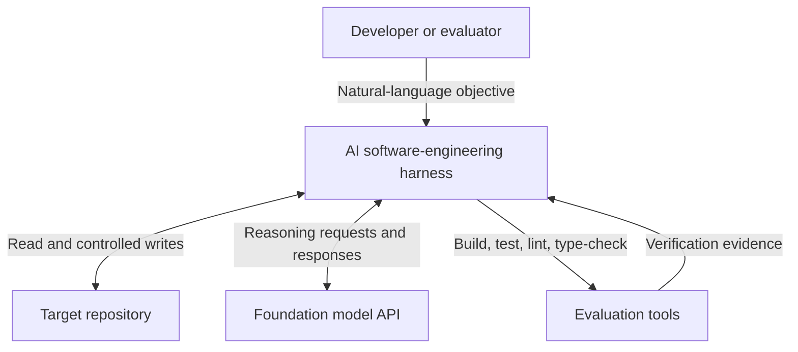

#### Diagram 2 — Component architecture

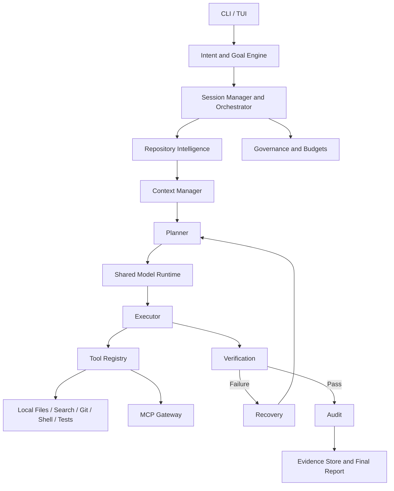

#### Diagram 3 — State machine

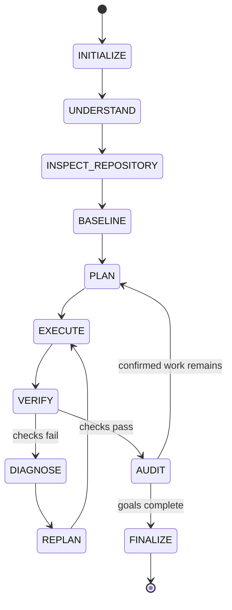

#### Diagram 4 — End-to-end sequence

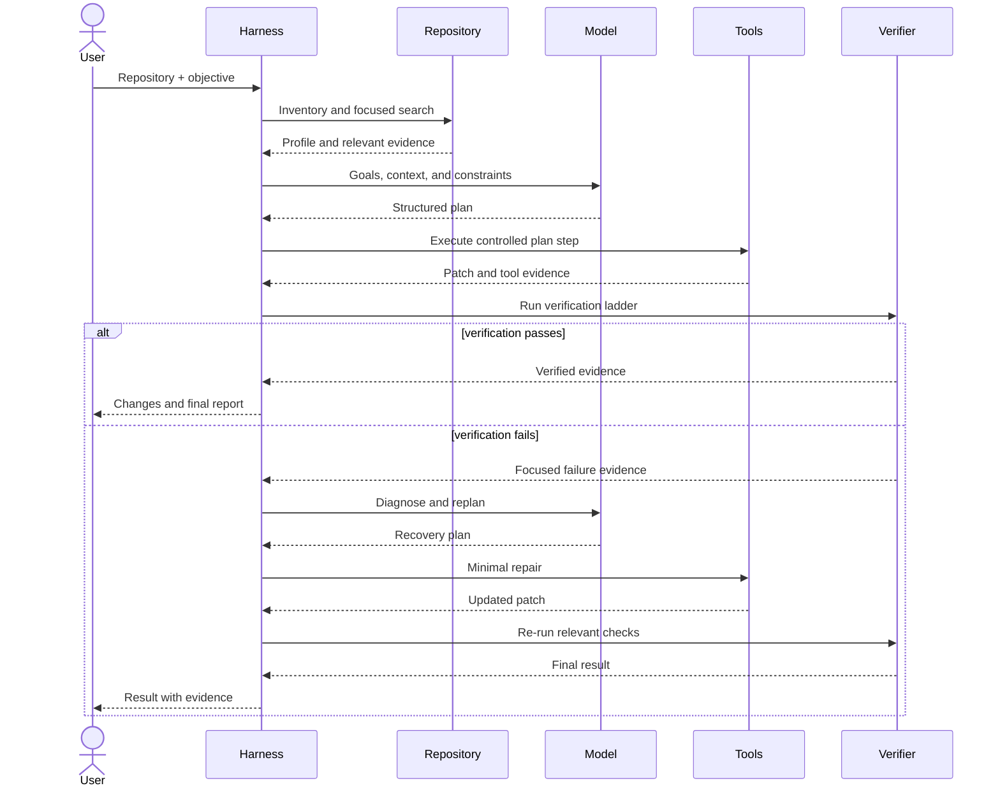

#### Diagram 5 — Repository intelligence

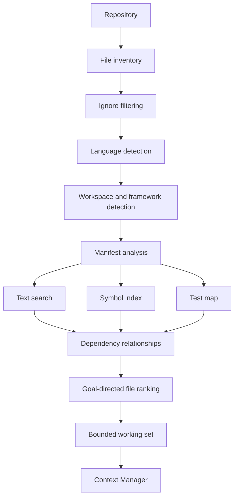

#### Diagram 6 — Verification and recovery

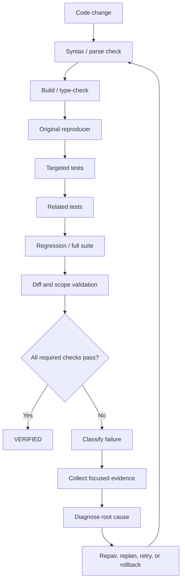

#### Diagram 7 — Data flow

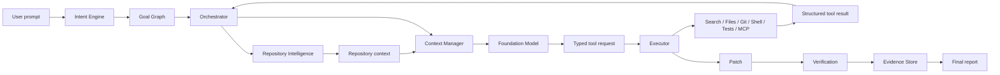

#### Diagram 8 — Deployment and runtime

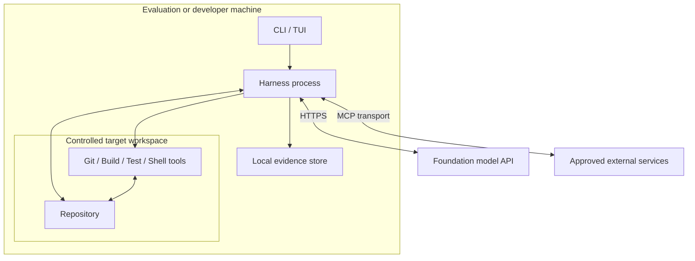

### 8.2 Supporting diagrams

#### Diagram 9 — Goal graph and planning

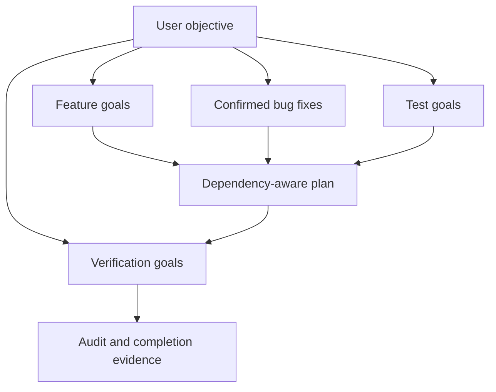

#### Diagram 10 — Tool architecture

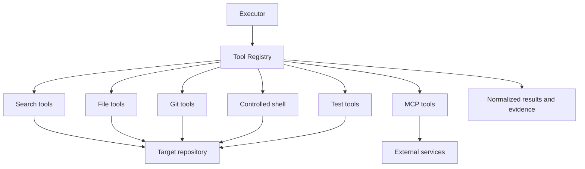

#### Diagram 11 — Context management

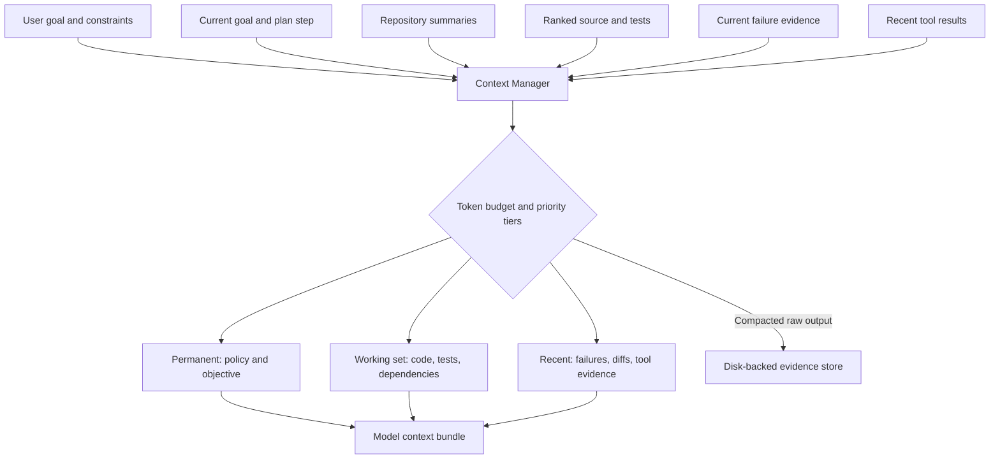

---

## 9. Agent model

Use one common `ModelClient` and seven logical agents. Each agent differs by prompt, allowed tools, context slice, and output schema.

```python
class ModelClient:
    async def generate(self, messages, tools=None, response_schema=None):
        ...
```

### Agent matrix

| Agent | Responsibility | Write access | Typical output |
|---|---|---:|---|
| Intent & Goal | Convert user objective into goals, constraints, acceptance criteria | No | `GoalGraph` |
| Repository Intelligence | Profile repo and identify likely relevant areas | No | `RepositoryProfile`, candidate files |
| Planner | Turn goals + evidence into dependency-aware steps | No | `ExecutionPlan` |
| Executor / Coding | Apply the current approved plan step using tools | Yes | tool requests, patch actions |
| Verification | Select/run deterministic checks and interpret results | No | `VerificationReport` |
| Recovery | Diagnose a failed check and propose bounded repair strategy | No | `RecoveryPlan` |
| Audit | Search affected scope for additional reproducible defects | No | `Finding[]` |

### Why logical agents

- shared runtime reduces duplicated infrastructure
- one model can be swapped without rewriting every agent
- tool permissions are easy to enforce per role
- agent state remains orchestrator-controlled
- context can be tailored by task rather than replicated seven times

---

## 10. Tool architecture

The model never directly touches the OS. It requests tools through a registry. Tools return structured results and evidence references.

### MVP built-in tools

| Tool | Purpose | Mutating |
|---|---|---:|
| `repo_tree` | Bounded repository tree | No |
| `search_text` | Fast exact/regex search | No |
| `find_symbol` | Locate declarations | No |
| `find_references` | Locate call/reference sites | No |
| `read_file` | Read small file | No |
| `read_range` | Read exact line range | No |
| `create_file` | Create file in approved scope | Yes |
| `apply_patch` | Apply minimal diff | Yes |
| `run_command` | Controlled shell command | Potentially |
| `run_tests` | Project-specific test command | No source mutation expected |
| `git_status` | Working tree state | No |
| `git_diff` | Inspect changes | No |
| `create_checkpoint` | Git checkpoint/stash/commit abstraction | Yes |
| `rollback` | Restore checkpoint when recovery requires it | Yes |

### Agent permissions

| Agent | Search | Read | Patch | Shell | Tests | Git diff/status |
|---|---:|---:|---:|---:|---:|---:|
| Intent | — | — | — | — | — | — |
| Repository | ✓ | ✓ | — | limited | ✓ | ✓ |
| Planner | ✓ | ✓ | — | — | — | ✓ |
| Executor | ✓ | ✓ | ✓ | ✓ | limited | ✓ |
| Verification | ✓ | ✓ | — | ✓ | ✓ | ✓ |
| Recovery | ✓ | ✓ | — | limited | ✓ | ✓ |
| Audit | ✓ | ✓ | — | ✓ | ✓ | ✓ |

### Tool result contract

Every tool result should include:

```json
{
  "ok": true,
  "summary": "18 tests passed",
  "data": {},
  "artifacts": [],
  "truncated": false,
  "duration_ms": 931
}
```

Large stdout is stored as an artifact and summarized before entering context.

---

## 11. MCP strategy

MCP is an integration boundary, not the internal implementation of every tool. Local repository operations should stay native because they are faster, easier to sandbox, and work offline. MCP is used when the harness must interact with an external system.

### Recommended MCP integrations

| MCP | MVP priority | Use |
|---|---|---|
| GitHub | High | Read issues/PRs, comments, metadata; later create PRs after user approval. |
| Documentation/search | Medium | Retrieve current library/framework documentation when local evidence is insufficient. |
| Issue tracker (Linear/Jira) | Stretch | Import acceptance criteria and task metadata. |
| CI provider | Stretch | Query remote build/test results. |

### MCP gateway responsibilities

`mcp/gateway.py` should:

- register available MCP servers and capabilities
- expose server operations as typed harness tools
- enforce per-agent permissions
- redact secrets from results
- normalize failures/timeouts
- attach provenance (`server`, `operation`, `resource`) to evidence

### MCP context policy

Never copy an entire issue history, PR thread, or documentation site into the model. Fetch the smallest useful resource, summarize it, preserve the original resource ID/URL, and retrieve more only when needed.

---

## 12. Context-window architecture

Context management is a core product subsystem. A "large context window" is useful headroom, but it is not the scalability strategy. Repositories can exceed any fixed model window, and model quality often degrades when irrelevant context grows.

### 12.1 Model capability profile

The model adapter exposes runtime limits instead of hard-coding a token number:

```python
ModelCapabilities(
    context_window_tokens=...,   # provider/model specific
    max_output_tokens=...,
    tool_calling=True,
)
```

The context manager derives its budget from those capabilities.

### 12.2 Context budget

For context window `W`, reserve capacity before selecting repository evidence:

```text
10%  system + agent instructions
10%  user objective + goals + plan + constraints
15%  recent tool calls/results
45%  repository working set
10%  summaries / dependency evidence / failures
10%  output + emergency headroom
```

These are defaults, not hard-coded model assumptions. The manager can rebalance within safe minimums. It must never consume the final output/headroom reserve with repository text.

For example, with an effective 128k-token input budget, the working-set target is roughly 57k tokens. With a larger model window, the same percentage policy grows naturally, but retrieval and ranking still apply.

### 12.3 Priority tiers

Context items are ranked:

| Priority | Content | Eviction policy |
|---|---|---|
| P0 | system safety/tool policy | never evict |
| P1 | user objective, constraints, acceptance criteria | never evict |
| P2 | current plan step + active failure | pin until resolved |
| P3 | directly edited/referenced source ranges | high retention |
| P4 | related tests/callers/dependencies | task-dependent |
| P5 | recent tool results | summarize as they age |
| P6 | repo/module summaries | compress/replaceable |
| P7 | old conversation/history | first to evict |

### 12.4 Working-set algorithm

1. Start with objective, current goal, current plan step, and any active failure.
2. Add exact files named by the user/issue/plan.
3. Search symbols/text for declarations, callers, tests, and config.
4. Rank candidates using lexical match, path proximity, dependency edges, recent edits, and test relationship.
5. Load bounded ranges before full files.
6. Deduplicate overlapping ranges.
7. Stop when the repository-context budget is filled.
8. Preserve excluded candidates in the index so they can be fetched later.

### 12.5 Large-repository scalability

For a huge monorepo:

```text
Repository
   ↓
Ignore rules + file inventory
   ↓
Language / manifest / workspace detection
   ↓
Module summaries + symbol/search index
   ↓
Goal-directed candidate ranking
   ↓
Small task working set
   ↓
Model
```

The repository index can contain millions of lines because the index is not the prompt. The model receives only the evidence needed for the current step.

### 12.6 Progressive disclosure

Use three levels:

- **L0 metadata:** path, language, size, symbols, imports, test relationship
- **L1 summary:** module/file purpose and important interfaces
- **L2 source:** exact line ranges or full file when required

Most repository files stay at L0. Only likely relevant files progress to L1/L2.

### 12.7 Compaction

Trigger compaction when estimated input reaches ~80% of the safe budget or after a major goal completes.

Compaction writes a structured checkpoint:

```json
{
  "completed_goals": [],
  "current_goal": {},
  "important_decisions": [],
  "changed_files": [],
  "known_failures": [],
  "verification": {},
  "next_actions": [],
  "evidence_refs": []
}
```

Old raw tool output leaves the prompt but remains in the evidence store.

### 12.8 Context invalidation

After a patch:

- invalidate summaries for modified files
- refresh symbols/dependencies affected by the patch
- keep prior content only as diff evidence
- re-read changed ranges before verification reasoning

### 12.9 Token/cost observability

Record per model call:

- estimated and provider-reported input tokens
- output tokens
- context items selected
- context bytes/tokens by category
- cache hits if provider supports caching
- model latency and cost when available

This allows the team to demonstrate that the harness scales through retrieval and context discipline, not just a larger model limit.

---

## 13. Repository intelligence

### Pipeline

```text
Repository
  ↓
File inventory
  ↓
Ignore filtering (.gitignore + built-in ignores)
  ↓
Language detection
  ↓
Manifest/framework detection
  ↓
Search + symbols + test mapping
  ↓
Dependency relationships
  ↓
Candidate ranking
  ↓
Context working set
```

### MVP implementation

Prefer cheap deterministic primitives first:

- `git ls-files` / filesystem walk
- `.gitignore` semantics where available
- `rg` for text discovery
- standard manifest parsing (`pyproject.toml`, `package.json`, etc.)
- language-specific lightweight parsing only when required

Do not require embeddings for the MVP. Add semantic retrieval only if lexical/symbol/dependency retrieval measurably misses relevant code.

---

## 14. Planning

The planner returns structured steps, not prose-only intentions.

```json
{
  "goal": "Fix invalid password handling",
  "steps": [
    {"id":"S1","action":"inspect","target":"services/auth.py"},
    {"id":"S2","action":"inspect","target":"routes/auth.py"},
    {"id":"S3","action":"patch","target":"routes/auth.py","depends_on":["S1","S2"]},
    {"id":"S4","action":"verify","target":"tests/test_auth.py","depends_on":["S3"]}
  ]
}
```

Plan rules:

- every write step names target scope
- every goal has a verification step
- dependencies are explicit
- steps are small enough to recover independently
- replanning occurs after material new evidence or failure

---

## 15. Orchestration and state machine

```text
INITIALIZE
   ↓
UNDERSTAND
   ↓
INSPECT_REPOSITORY
   ↓
BASELINE
   ↓
PLAN
   ↓
EXECUTE
   ↓
VERIFY ───── failure ───► DIAGNOSE ─► REPLAN ─► EXECUTE
   │
 success
   ↓
AUDIT
   ↓
MORE CONFIRMED WORK? ─ yes ─► PLAN
   │ no
   ↓
FINALIZE
```

The orchestrator, not individual agents, owns state transitions and the authoritative session object.

---

## 16. Verification strategy

Verification is a ladder. Run the cheapest relevant check first and widen only after it passes.

```text
Patch
 ↓
Parse / syntax check
 ↓
Build / type check when applicable
 ↓
Original reproducer
 ↓
Targeted tests
 ↓
Related tests
 ↓
Regression/full suite
 ↓
Diff/scope validation
 ↓
VERIFIED
```

The exact ladder is supplied by a project adapter. A Python adapter may use `pytest`; Node may use package scripts discovered from `package.json`.

---

## 17. Recovery

Failure classes:

- syntax failure
- build failure
- test failure
- patch conflict/failure
- tool failure
- timeout
- plan failure
- loop/repetition
- context failure
- environment/dependency failure

Recovery input is intentionally narrow:

- failing command/check
- concise error output
- latest diff
- affected source ranges
- relevant test
- previous attempts and why they failed

Recovery output:

```json
{
  "failure_class": "TestFailure",
  "root_cause": "InvalidCredentials is not translated to HTTP 401",
  "repair": "Handle exception in auth route",
  "reverify": ["target_test", "related_tests"]
}
```

The orchestrator rejects retries that exceed budget or repeat the same action/result fingerprint.

---

## 18. Audit model

Audit findings have a lifecycle:

```text
SUSPECTED → REPRODUCED → CONFIRMED → PATCHED → VERIFIED
```

An LLM-only observation remains `SUSPECTED`. It becomes repair work after a test, static-analysis finding, build failure, runtime reproduction, or other deterministic evidence establishes the defect.

---

## 19. Project adapters

Use a small adapter contract for language/project differences:

```python
class ProjectAdapter:
    def detect(self): ...
    def setup_commands(self): ...
    def build_commands(self): ...
    def lint_commands(self): ...
    def typecheck_commands(self): ...
    def target_test_command(self, tests): ...
    def full_test_command(self): ...
```

MVP adapters:

- Python
- Node.js

Adapter detection is manifest-based and should prefer existing project scripts/configuration over invented commands.

---

## 20. Governance and budgets

Example session budget:

```python
Budget(
    max_model_calls=20,
    max_iterations=30,
    max_retries_per_goal=3,
    max_audit_rounds=2,
    command_timeout_seconds=120,
)
```

Budget values are configurable constraints. The orchestrator records why a session stopped when a budget is exhausted.

### Loop detection

Fingerprint:

```text
tool name + normalized arguments + result hash
```

Three materially identical attempts trigger forced replanning rather than a fourth blind retry.

### Scope guard

If the allowed scope is `backend/auth/`, a write to `frontend/app.tsx` is rejected by the tool layer before execution.

---

## 21. Evidence and run storage

```text
runs/<session-id>/
├── session.json
├── request.json
├── goals.json
├── repository.json
├── baseline.json
├── plan.json
├── events.jsonl
├── tool-calls.jsonl
├── findings.json
├── patches.diff
├── verification.json
├── metrics.json
└── final-report.md
```

Large raw outputs may be stored under `runs/<id>/artifacts/` and referenced by hash/path.

---

## 22. Proposed repository layout

This is the target layout, not a requirement to scaffold every empty file before implementation needs it.

```text
harness/
├── main.py
├── interaction/
├── intent/
├── core/
├── repository/
├── context/
├── planning/
├── model/
├── agents/
├── execution/
├── tools/
├── verification/
├── recovery/
├── audit/
├── governance/
├── telemetry/
├── adapters/
└── mcp/

tui/
tests/
runs/
```

Create modules when their first behavior is implemented. Avoid empty architecture scaffolding.

---

## 23. Four-person ownership model

Detailed implementation sequencing is in `docs/TEAM_PLAN.md`. Product-level ownership is:

| Owner | Area | Primary deliverable |
|---|---|---|
| Person A | Orchestrator + session/state + intent/planning contracts | End-to-end control flow |
| Person B | Repository intelligence + context manager | Scalable working-set construction |
| Person C | Tool execution + project adapters + verification/recovery | Reliable code-changing loop |
| Person D | CLI/TUI + evidence/telemetry + MCP integration + demo | Usable product and observable run |

All four contributors share responsibility for tests and integration in their owned area.

---

## 24. Delivery milestones

### Milestone 1 — Skeleton that can run a session

- CLI/TUI accepts repository + objective
- session/state machine exists
- repository profile works
- mock/model adapter returns structured goals and plan
- event log exists

### Milestone 2 — Read-only intelligence

- tree/search/read tools
- Python/Node detection
- context working set with token budget
- plan generated from real repository evidence

### Milestone 3 — Code-changing loop

- apply-patch and controlled shell tools
- checkpoints and diff
- Python/Node test commands
- verification report

### Milestone 4 — Recovery + audit

- failure classification
- bounded replan/retry
- loop detection
- reproducible audit findings

### Milestone 5 — Hackathon polish

- GitHub MCP issue ingestion
- complete TUI status flow
- evidence-backed final report
- demo scenarios
- latency/token metrics
- CI passing

---

## 25. Demo scenarios

### Scenario A — Existing bug

Input: repository with one failing authentication test.  
Expected demo: repository discovery → targeted context → patch → failed first attempt (optional) → recovery → passing target + full tests.

### Scenario B — New feature

Input: small FastAPI/Node repo and objective to add a bounded feature.  
Expected demo: goals → plan → edits → generated/updated tests → verification.

### Scenario C — Large repository/context demo

Use a repository significantly larger than the configured prompt budget. Show:

- number of repository files/tokens discovered
- number selected into working set
- why selected files entered context
- compaction event
- successful retrieval of a file that was not initially loaded

This is the strongest proof that context-window scalability is implemented rather than claimed.

---

## 26. Success metrics

### Correctness

- percentage of demo tasks ending with required tests passing
- regression rate on previously passing tests
- false `VERIFIED` rate (target: zero in judged scenarios)

### Efficiency

- model calls per completed goal
- input tokens per task
- percentage of repository text actually loaded into context
- tool calls per verified change
- recovery attempts per goal

### Reliability

- success rate after first verification failure
- repeated-action blocks triggered
- sessions stopped correctly by budget/scope rules

### UX

- time from command start to first plan
- clarity of TUI state and final evidence

---

## 27. Risks and mitigations

| Risk | Impact | Mitigation |
|---|---|---|
| Huge repository overwhelms prompt | Poor quality/cost | Retrieval, ranges, summaries, compaction, token budget |
| Agent loops | Cost/time | Action fingerprint, retry limits, forced replan |
| Wrong files edited | Regressions | scope guard, dependency context, diff review |
| Model invents success | False completion | deterministic verification gate |
| Tool output floods context | Lost signal | truncation + artifact storage + summaries |
| Multi-agent divergence | Conflicting state | orchestrator is single state owner |
| External MCP unavailable | Blocked task | degrade gracefully to local tools when possible |
| Environment cannot build repo | Ambiguous failure | classify environment failures separately from code failures |

---

## 28. CI/CD requirements

CI must run on every pull request and push to `main`:

- repository hygiene checks
- merge-conflict marker detection
- Python syntax/tests when Python project files exist
- Node tests/build when Node project files exist
- fail fast on real test/build failures

CD for the current pre-deployment phase means release packaging on version tags:

- run the same CI checks
- create deterministic source archive
- create SHA-256 checksum
- upload release artifact

Once the team chooses an actual runtime target (container registry, VM, hosted service, etc.), deployment can be added as a separate environment-gated job without changing the CI contract.

---

## 29. GitHub issue status

As checked on **2026-09-26**, [`affan80/pentester-AI-harness`](https://github.com/affan80/pentester-AI-harness/issues) has 20 open parent implementation issues and 60 linked feature sub-issues derived from this PRD. Every issue includes scope, acceptance criteria, dependencies, PRD references, required verification evidence, and suggested ownership. The complete hierarchy is indexed in [`docs/ISSUE_BREAKDOWN.md`](ISSUE_BREAKDOWN.md).

| Milestone | Issues | Scope |
|---|---|---|
| M1 | [#1–#6](https://github.com/affan80/pentester-AI-harness/issues?q=is%3Aissue+is%3Aopen+%5BM1%5D) | Core state, evidence, CLI/TUI, repository profile, goals, and model client |
| M2 | [#7–#10](https://github.com/affan80/pentester-AI-harness/issues?q=is%3Aissue+is%3Aopen+%5BM2%5D) | Tool registry, discovery, scalable context, and planning |
| M3 | [#11–#14](https://github.com/affan80/pentester-AI-harness/issues?q=is%3Aissue+is%3Aopen+%5BM3%5D) | Execution, patching, shell/Git controls, adapters, and verification |
| M4 | [#15–#16](https://github.com/affan80/pentester-AI-harness/issues?q=is%3Aissue+is%3Aopen+%5BM4%5D) | Recovery, loop detection, rollback, and evidence-gated audit |
| M5 | [#17–#20](https://github.com/affan80/pentester-AI-harness/issues?q=is%3Aissue+is%3Aopen+%5BM5%5D) | Telemetry, MCP, demos, integration, and release |

Parent issues are milestone completion gates. Their three native GitHub sub-issues divide the work into core contract, operational behavior, and verification/integration slices that can be assigned and reviewed independently.

---

## 30. Definition of done for hackathon submission

The product is demo-ready when all of the following are true:

- one command starts the CLI/TUI
- repository + natural-language objective are accepted
- intent, repository intelligence, context, plan, execution, verification, and finalization run end-to-end
- at least one real source patch is performed through the tool layer
- failure recovery is demonstrable
- large-repository context selection is measurable
- Python or Node verification executes deterministically
- final report contains evidence and changed-file summary
- CI passes on `main`
- contributor workflow is documented
- the four team members can work in separate owned areas without editing the same core files continuously
